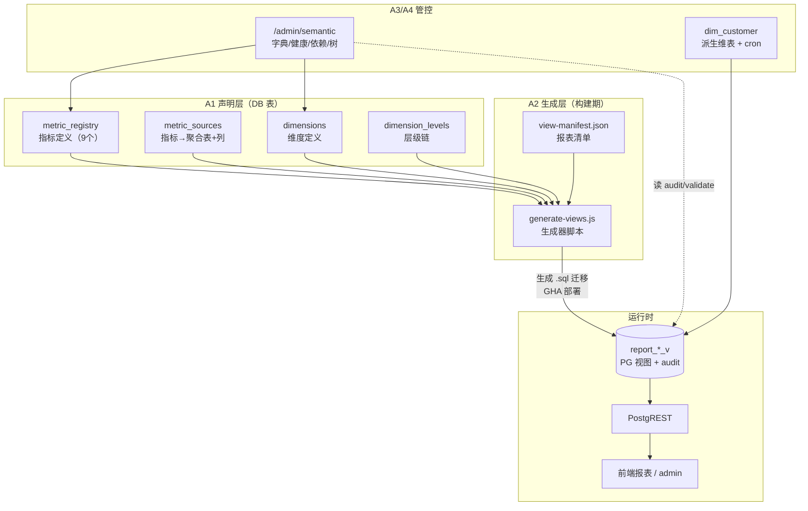
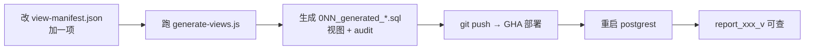
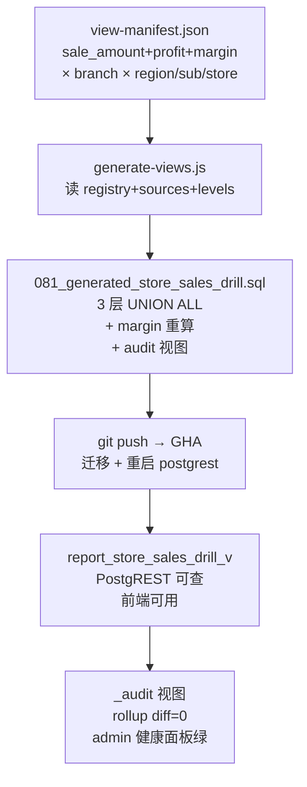

# 语义层使用指南

> 本文档面向「要用语义层做报表/扩展指标维度」的使用者。基建（Phase A1-A4）已就绪，这里讲**怎么用**。

---

## 1. 一句话定位

语义层 = 把「指标」和「维度」变成数据库里的**声明**（几张表），生成器读声明**自动产出报表视图**。做新报表基本不用手写 SQL，只改声明 + 加一行清单。

---

## 2. 基建全景

### 2.1 四层架构

| 层 | 职责 | 载体 |
|---|---|---|
| **A1 声明层** | 声明有哪些指标、维度、层级 | DB 表 `metric_registry` / `metric_sources` / `dimensions` / `dimension_levels` |
| **A2 生成层** | 读声明自动产报表视图 | `scripts/generate-views.js` + `scripts/view-manifest.json` |
| **A3 管理层** | 可视化看全貌 + 健康自检 | `/admin/semantic`（字典/健康/依赖图/层级树 4 Tab） |
| **A4 维度层** | 派生维度物化（客户） | `dim_customer` + `/derive-dim-customer` + cron |

### 2.2 总体数据流



**三个时期**：
- **构建期**（开发者跑脚本）：改 manifest → 跑生成器 → 产出 .sql
- **部署期**（GHA）：跑迁移建视图 → 重启 postgrest
- **运行时**（用户）：PostgREST 查视图；admin 看健康；audit 常驻自检

---

## 3. 当前已有

- **9 个指标**（`metric_registry`）：
  - base：`sale_amount`/`sale_profit`、`delivery_amount`/`delivery_profit`、`wholesale_amount`/`wholesale_profit`
  - derived：`outbound_amount`/`outbound_profit`（配送+批发）、`margin`（毛利率）
- **3 个维度**（`dimensions`）：
  - `branch`（三级：region → sub_region → store）
  - `item`（单品级）
  - `customer`（批发客户，129 个，派生）
- **1 个生成视图**：`report_store_sales_drill_v`（门店销售三层下钻）+ `_audit`
- **管理页**：`/admin/semantic`（4 Tab）

---

## 4. 日常会做的 4 件事

### 4.1 加一个新报表视图 ⭐ 最常用

比如要「品类销售下钻」或「战区出库下钻」报表。



**步骤**：
1. 编辑 `scripts/view-manifest.json`，`views` 数组加一项：
```json
{
  "name": "category_sales_drill",
  "metrics": ["sale_amount", "sale_profit", "margin"],
  "dimension": "branch",
  "levels": ["region", "sub_region", "store"],
  "assessed_filter": true,
  "target_scoped": true,
  "audit": true
}
```
2. 跑生成器（连本地 dev PG 读声明）：
```bash
DATABASE_URL=postgresql://postgres:<pw>@localhost:5432/insforge node scripts/generate-views.js
```
3. 生成器产出 `database/migrations/0NN_generated_category_sales_drill.sql`（多层 UNION ALL + 指标列 + audit 视图，**勿手改**）
4. `git push` → GHA 部署 → 重启 postgrest
5. 前端/PostgREST 查 `report_category_sales_drill_v`

**生成视图列结构**（统一）：`level` / `parent_code` / `target_id` / `code` / `name` / 各指标列。

### 4.2 加一个新指标

比如「客单价 = 销售金额 / 客单数」。


- **base 指标**（直接聚合）：`metric_registry` 填 `measure_type='base'` + `fact_table` + `value_column` + `agg`；`metric_sources` 填 `source_table` + `source_column`
- **derived 指标**（运算）：`metric_registry` 填 `measure_type='derived'` + `formula` + `depends_on`（依赖的 metric_code 数组）+ `additive`（比率类 = false，生成器会重算分量而非直接 SUM）

示例（derived）：
```sql
INSERT INTO metric_registry (metric_code, name, measure_type, formula, depends_on, additive, unit)
VALUES ('avg_transaction_value','客单价','derived','sale_amount / transaction_count',
        '["sale_amount","transaction_count"]', false, '元');
```

### 4.3 加一个新维度

比如「品类」维度（category_l1 → category_l2 → item）。


1. 维表物化：独立维表（仿 dim_branch 采集）或派生（仿 dim_customer 从明细 DISTINCT）
2. `dimensions` 注册：`dim_code` + `join_table` + `join_key` + `source_type`(static/derived)
3. `dimension_levels` 注册层级：每层 `level_code` + `depth` + `key_column` + `name_column` + `parent_level`
4. 重启 postgrest → 生成器 manifest 可用新维度产视图

> customer 维度（A4）就是这套：`dim_customer` 派生 + `dimensions`/`dimension_levels` 注册单层。

### 4.4 看健康 / 排查

打开 `/admin/semantic`（需 admin 权限）：

| Tab | 看什么 | 怎么用 |
|---|---|---|
| **字典** | 全部指标+维度定义 | 确认指标口径、筛选指标/维度 |
| **健康** | rollup diff + validate 配置校验 | 🔴 视图层间不一致 / 配置错误；🟢 健康 |
| **维度层级** | 维度树（region→sub_region→store） | 看层级结构、关联键 |
| **依赖图** | 指标依赖关系（base→derived） | 点节点高亮依赖链，看 margin 怎么算的 |

**健康面板的 audit**：每个生成视图配套 `report_*_v_audit`，检查各层加总是否一致（diff=0 健康）。diff≠0 说明生成器逻辑或数据有问题。

---

## 5. 完整实例：store_sales_drill 怎么来的



**关键点**：
- `margin` 是 derived + `additive=false` → 生成器自动重算 `SUM(profit)/NULLIF(SUM(amount),0)`（不直接 SUM 比率）
- 三层 UNION ALL（region/sub_region/store）+ `parent_code` 串联层级
- audit 视图常驻，层间加总 diff=0 即健康
- 这套流程产出的视图，双轨对账时还发现了 Phase 1 手写视图 `region_breakdown_v` 的重复计算 bug（语义层的额外价值）

---

## 6. 语义层的价值

| 痛点 | 语义层怎么解 |
|---|---|
| 同一指标各报表口径不一致 | 指标定义只在 `metric_registry` 一处，所有视图共用 |
| 新报表要手写上百行 UNION SQL | 加 manifest 一项 + 跑生成器，自动产出 |
| 视图层间加总对不上难发现 | 每视图自带 audit，diff≠0 admin 标红 |
| 指标依赖关系不清 | 依赖图可视化（margin 依赖谁、outbound 合并谁） |
| 比率类指标（毛利率）直接 SUM 出错 | `additive=false` 标记，生成器强制重算分量 |

---

## 7. 命令速查

```bash
# 跑视图生成器（连本地 dev PG）
DATABASE_URL=postgresql://postgres:<pw>@localhost:5432/insforge node scripts/generate-views.js

# 重启 postgrest（加表/列/视图后必做，刷 schema 缓存）
ssh -i ~/.ssh/ShanHai-OPS.pem root@data.shanhaiyiguo.com \
  "cd /opt/data-analytics-platform/deploy && docker compose restart postgrest"

# 手动触发客户维度派生（debug 用）
ssh -i ~/.ssh/ShanHai-OPS.pem root@data.shanhaiyiguo.com \
  "docker exec deploy-web-1 node -e 'fetch(\"http://duckdb:9000/derive-dim-customer\",{method:\"POST\",headers:{\"x-agent-key\":process.env.AGENT_API_KEY}}).then(async r=>console.log(r.status,await r.text()))'"

# 查语义层健康（SQL）
docker exec deploy-postgres-1 psql -U postgres -d insforge -c \
  "SELECT * FROM validate_semantic_registry();   -- 0 行=配置健康"
docker exec deploy-postgres-1 psql -U postgres -d insforge -c \
  "SELECT MAX(region_vs_store_diff) FROM report_store_sales_drill_v_audit;  -- 0=rollup 一致"

# 双轨对账（生成视图 vs Phase 1 手写视图）
docker exec deploy-postgres-1 psql -U postgres -d insforge -f scripts/reconcile-phase1.sql
```

---

## 8. 关键文件索引

| 文件 | 作用 |
|---|---|
| `database/migrations/076_metric_registry.sql` | 9 指标定义（A1） |
| `database/migrations/077_dimensions.sql` | branch/item 维度+层级（A1） |
| `database/migrations/078_validate_semantic_registry.sql` | 配置校验函数 |
| `database/migrations/079_semantic_dictionary_v.sql` | 字典视图（admin 字典 Tab 数据源） |
| `database/migrations/080_metric_sources.sql` | 指标→数据源映射（A2） |
| `scripts/view-manifest.json` | **报表清单（加视图改这里）** |
| `scripts/generate-views.js` | **视图生成器** |
| `database/migrations/081_generated_store_sales_drill.sql` | 首个生成视图（机器产物） |
| `scripts/reconcile-phase1.sql` | 双轨对账脚本 |
| `database/migrations/082_dim_customer.sql` | 客户维度表（A4） |
| `database/migrations/083_register_customer_dimension.sql` | customer 维度注册（A4） |
| `services/server.js` `/derive-dim-customer` | 客户维度派生 endpoint |
| `web/app/admin/semantic/` | admin 页 4 Tab（A3） |
| `web/lib/semantic/health.ts` | 健康面板纯函数（动态发现 audit） |

---

## 9. 扩展阅读

- 设计 spec：`docs/superpowers/specs/2026-07-2x-semantic-layer-*.md`
- 实现计划：`docs/superpowers/plans/2026-07-2x-semantic-layer-*.md`
- 进度账本：`.superpowers/sdd/progress-semantic-a{1,2,3,4}.md`
- 架构总览：`docs/architecture.md`
